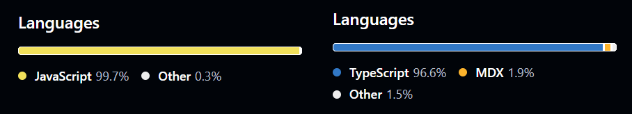

## Something was missing all along...

Before expanding my horizons by learning TypeScript in class, I imagined the language to be a wide-ranging restructuring of JavaScript involving a lot more than type specification. GitHub would list and color the language distinctly from JS-dominant repositories in its programming language breakdowns, and I operated under the assumption that my JS projects would be exceedingly difficult to adapt into TS. A teenage me would thus restrain himself unnecessarily by making the “choice” of practicing linting and style standards instead, when both skills could have been acquired and applied simultaneously. Perhaps unsurprisingly, I was blindsided to find out that the language is a rather moderate and straightforward expansion upon JS that, under typical compiler settings, would even transpile and run regardless of adherence to every TS rule. In a way, this realization has left me disillusioned when looking back at old code, which would previously seem complete, but now leaves me unimpressed the same way I would be when faced with a meal decently seasoned, but lacking my preferred, spicy kick. I now live plagued by the itch to rework some of my old JS projects into TypeScript.

 
*At age 16, seeing a repository like the one on the right would have me turning on my heel and looking elsewhere for code to use in my projects… after all, it isn’t JavaScript, right?*

## Up, up, and away...

But alas, we live, and we learn—now, instead of treating TypeScript and JavaScript as barely intersecting domains, I have come to view the former as an improvement upon a functional but flawed predecessor. Learning the language has also tied my approaches to building classes between strongly typed low-level languages and weakly typed high-level languages closer together. This, I expect, will make my programming more consistent overall.

The athletic software engineering aspect of ICS 314 has been unquestionably effective at building up my subconscious habits when writing in TypeScript. Time-sensitive exercises demand that one learns to visualize the structure of a solution as, not after, a problem description is skimmed and absorbed. I have also found that I keep my code perpetually and easily mutable as I write it, in the off-chance that I miss an edge case to handle in the problem requirements.

I am certain there is much more to TypeScript than what I have been able to glean from the first two modules. While I look forward to TypeScript 3, I am also disproportionately excited for the Databases and React UI modules, as the former pertains most closely to my field of interest, and the latter has been a goal of mine to explore for a while. Even as I anticipate a move away from the languages that were most formative in my early programming years, knowledge is accumulated, so the only way forward for me is up the slopes of accrued experience.