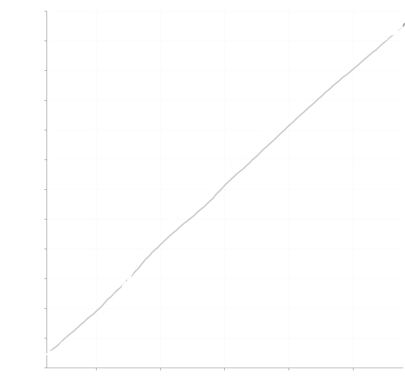

Group Growth was a minor project and one of my earliest forays into data visualization, developed in early 2020. It was made to show patterns in an online community's growth using a JSON API link, Vega, and Discord.js by readily producing a graph when prompted with a text command. At that time, I hosted it on a Raspberry Pi hooked up to an unreliable power source, so I often had gaps in my data. In a way, this project taught me about the value and intricacies of data gathering, storage, and analysis, which certainly influenced my career decisions.

