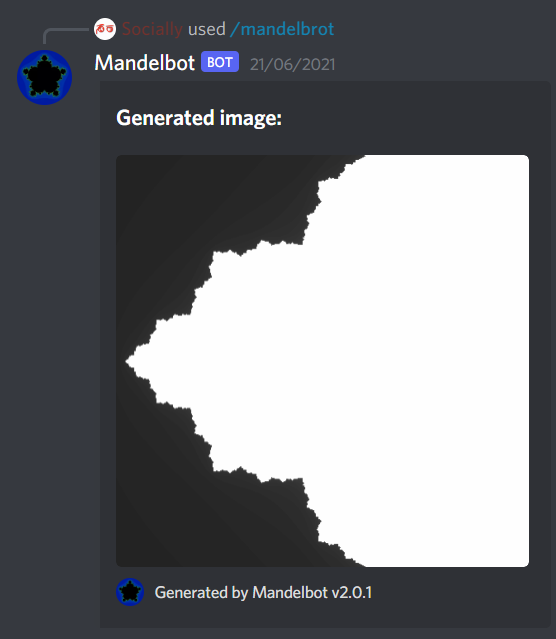
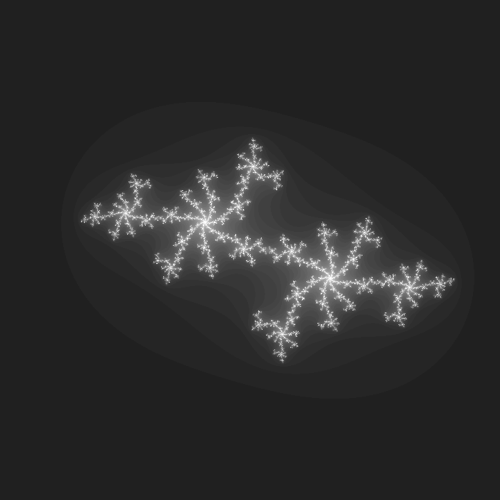

  

  
  
  

[Mandelbot](https://github.com/maximovicente/Mandelbot) was a passion project of mine developed throughout late 2021 that began after the topics of mathematical fractals and universality piqued my interest. The aim of the project was to familiarize myself with implementing algorithms to tranform abstract mathematical expressions into images, and to gain experience with the JS image processing library [JIMP](https://github.com/jimp-dev/jimp). After figuring out the specific math- and JIMP-related functions necessary to generate static images, I found that the gradients in these images, whose steps were based on the number of iterations required for a specified Mandelbrot/Julia equation to diverge past certain bounds, could be represented in motion by rendering each iteration of the equation as a separate frame. The resulting animations, when generated for the standard Mandelbrot set or a specific Julia set, I find to be quite beautiful. An example can be seen below. 

  

I also recommend checking out Movie Vertigo's [Mandelbrot Iteration](https://www.youtube.com/watch?v=pD7_n5gCUPI) video on YouTube, showing more smoothly the kinds of visuals these fundamental mathematical expressions can produce. If you are interested in learning more about these fractals and the math that governs them, there are plenty of resources on the matter, but I suggest starting with [2swap's video on the matter](https://www.youtube.com/watch?v=Ed1gsyxxwM0).